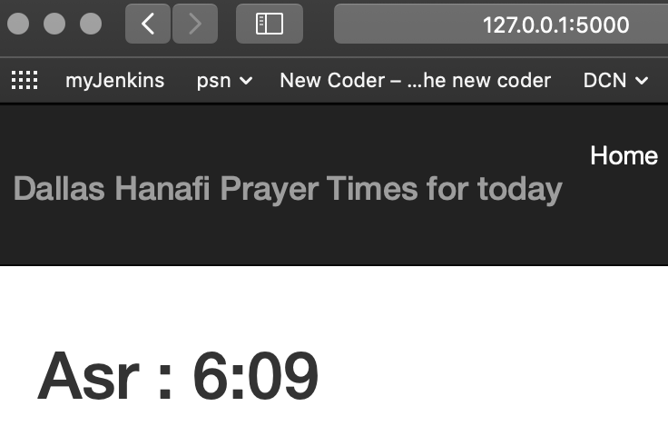

# hanafidallas
None of the hanafi mosques have to-the-minute prayer times for all prayers. this is an app selfishly for my personal convenience to find out mostly for when Asr is.

I've hooked this repo (master) to auto deploy to https://asrtime.herokuapp.com/

works locally:

#### References:
- how to crop a table using dimensions and feed that part of the pdf into a data frame
    - https://github.com/chezou/tabula-py